# Monitor Fabric Activity in the Monitoring Hub

!!! info "Reuse your workspace from the Dataflows Gen2 lab"
    You already have a workspace and lakehouse from this morning's **Dataflows Gen2** lab - use those instead of creating new ones. Open the workspace you created earlier and pick up from Step 1 below.

The *monitoring hub* in Microsoft Fabric provides a central place where you can monitor activity. You can use the monitoring hub to review events related to items you have permission to view.

## Step 1: Create and monitor a Dataflow

In Microsoft Fabric, you can use a Dataflow (Gen2) to ingest data from a wide range of sources. In this exercise, you'll use a dataflow to get data from a CSV file and load it into a table in your existing lakehouse.

1. Open your lakehouse from the Dataflows Gen2 lab. On the **Home** page, in the **Get data** menu, select **New Dataflow Gen2**.
2. Name the new dataflow `Get Product Data` and select **Create**.

    !!! abstract ""
        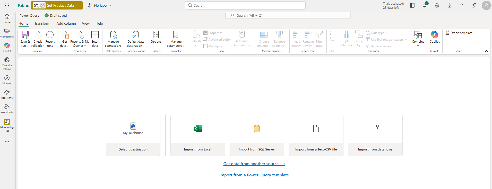

3. In the dataflow designer, select **Import from a Text/CSV file**. Then complete the Get Data wizard to create a data connection by linking to `https://raw.githubusercontent.com/MicrosoftLearning/dp-data/main/products.csv` using anonymous authentication.

    !!! abstract ""
        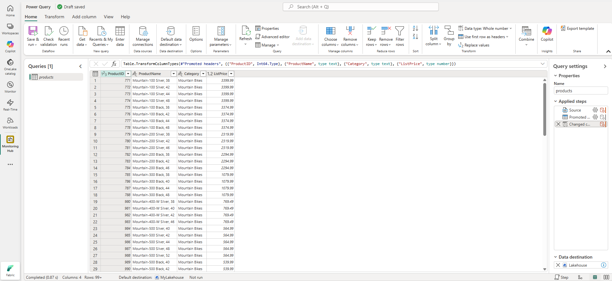

4. Use the **Save and run** option to save and run the dataflow, then close it.
5. In the navigation bar on the left, select **Monitor** to view the monitoring hub and observe that your dataflow is in-progress (if not, refresh the view until you see it).

    !!! abstract ""
        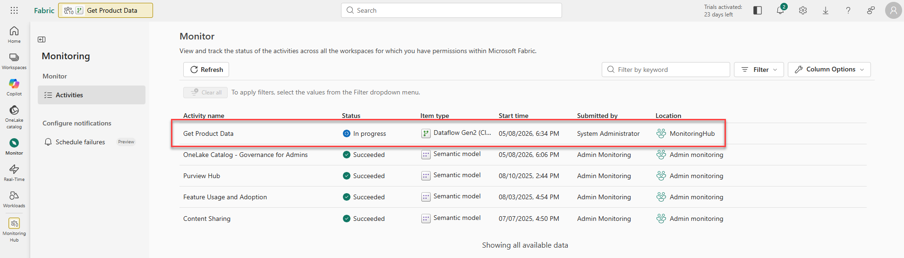

6. Wait for a few seconds, and then refresh the page until the status of the dataflow is **Succeeded**.
7. In the navigation pane, select your lakehouse. Then expand the **Tables** folder to verify that a table named **products** has been created and loaded by the dataflow (you may need to refresh the **Tables** folder). You should now see both **orders** (from the Dataflows Gen2 lab) and **products** in your lakehouse.

    !!! abstract ""
        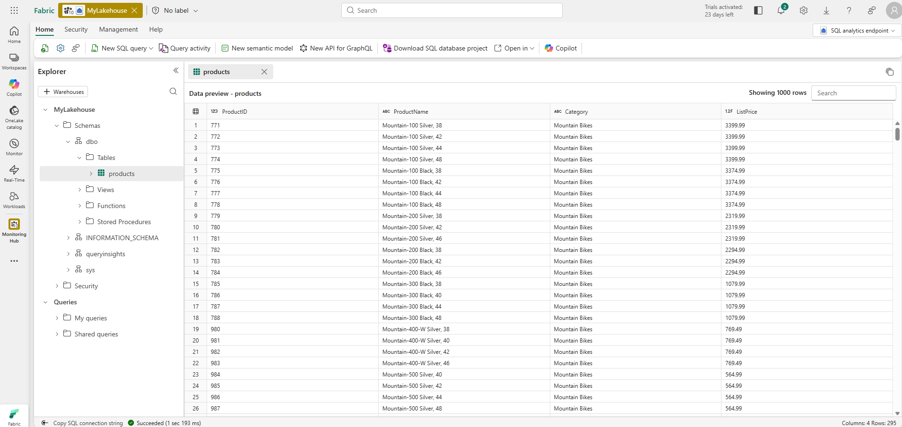

## Step 2: Create and monitor a Spark notebook

In Microsoft Fabric, you can use notebooks to run Spark code.

1. On the menu bar on the left, select **Create**. In the *New* page, under the *Data Engineering* section, select **Notebook**.

    A new notebook named **Notebook_1** is created and opened.

    !!! abstract ""
        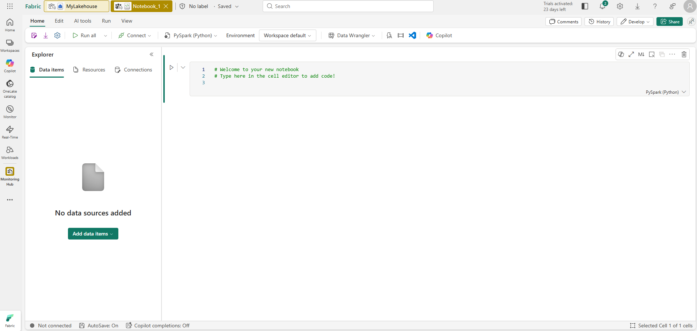

2. At the top left of the notebook, select the gear icon to view the notebook details, and change its name to `Query Products`.
3. In the notebook editor, in the **Explorer** pane, select **Add data items** and then select **From OneLake catalog**.
4. Add the lakehouse you're using for today's labs.
5. Expand the lakehouse item until you reach the **products** table.
6. In the **...** menu for the **products** table, select **Load data** > **Spark**. This adds a new code cell to the notebook.

    !!! abstract ""
        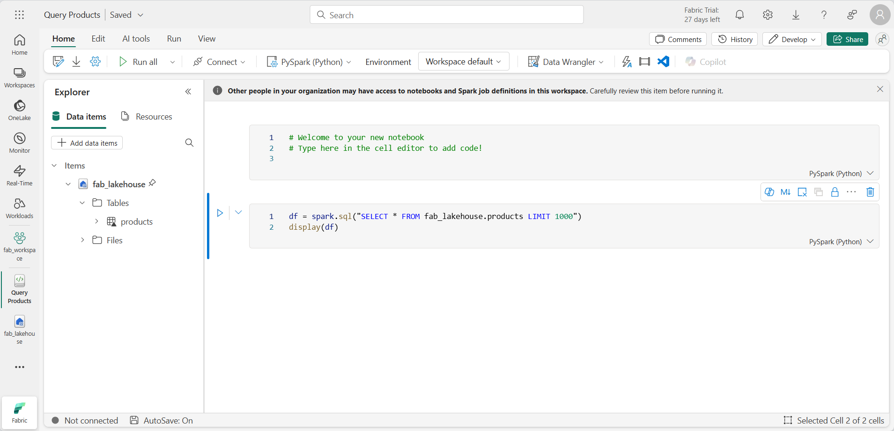

7. Use the **▶ Run all** button to run all cells in the notebook. It will take a moment or so to start the Spark session, and then the results of the query will be shown under the code cell.

    !!! abstract ""
        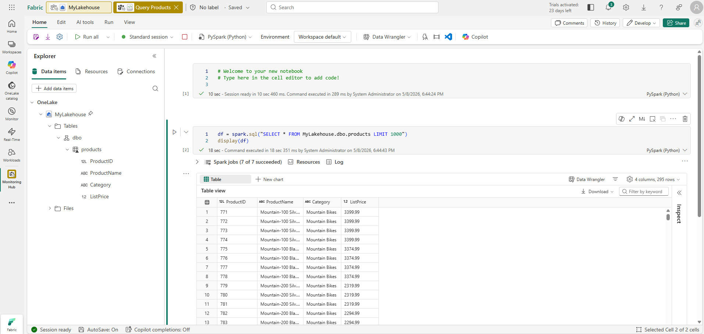

8. On the toolbar, use the **◻** (*Stop session*) button to stop the Spark session.
9. In the navigation bar, select **Monitor** to view the monitoring hub, and note that the notebook activity is listed.

    !!! abstract ""
        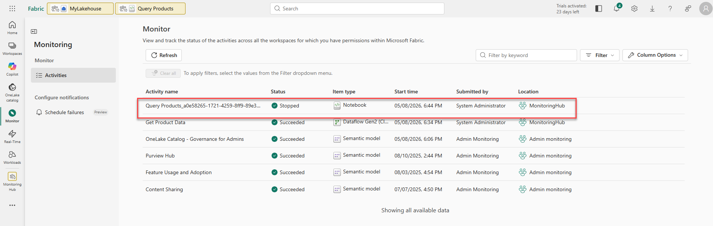

## Step 3: Monitor history for an item

Some items in a workspace might be run multiple times. You can use the monitoring hub to view their run history.

1. In the navigation bar, return to the page for your workspace. Then use the **↻** (*Refresh now*) button for your **Get Product Data** dataflow to re-run it.
2. In the navigation pane, select the **Monitor** page to view the monitoring hub and verify that the dataflow is in-progress.
3. In the **...** menu for the **Get Product Data** dataflow, select **Historical runs** to view the run history for the dataflow.

    !!! abstract ""
        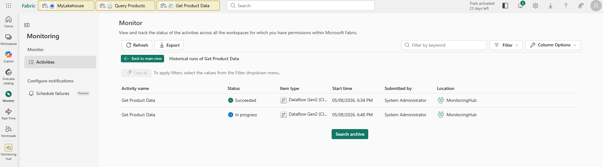

4. In the **...** menu for any of the historical runs select **View detail** to see details of the run.
5. Close the **Details** pane and use the **Back to main view** button to return to the main monitoring hub page.

## Step 4: Customize monitoring hub views

In this exercise you've only run a few activities, so it should be fairly easy to find events in the monitoring hub. However, in a real environment you may need to search through a large number of events. Using filters and other view customizations can make this easier.

1. Return to the monitoring hub main view. Use the **Filter** button to apply the following filter:
    - **Status**: Succeeded
    - **Item type**: Dataflow Gen2 (CI/CD)

    With the filter applied, only successful runs of dataflows are listed.

    !!! abstract ""
        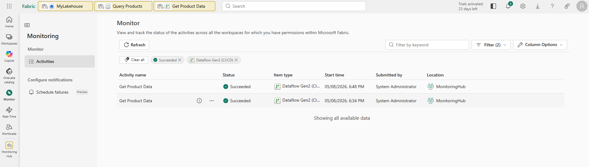

2. Use the **Column Options** button to include the following columns in the view (use the **Apply** button to apply the changes):
    - Activity name
    - Status
    - Item type
    - Start time
    - Submitted by
    - Location
    - End time
    - Duration
    - Refresh type

    You may need to scroll horizontally to see all of the columns.

    !!! abstract ""
        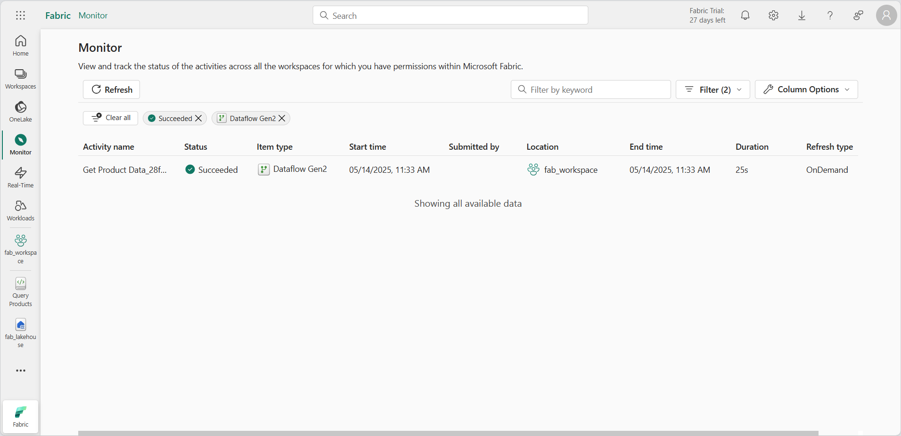

## Step 5: Clean up resources

In this exercise, you've added a dataflow and a Spark notebook to your workspace, and used the monitoring hub to view item activity.

If you've finished exploring, you can delete the workspace you've been using since the Dataflows Gen2 lab.

1. In the bar on the left, select the icon for your workspace to view all of the items it contains.
2. In the **...** menu on the toolbar, select **Workspace settings**.
3. In the **General** section, select **Remove this workspace**.

!!! note "The Monitor Data Warehouse lab (next) creates its own separate workspace for a sample data warehouse, so it's fine to remove this one now."
